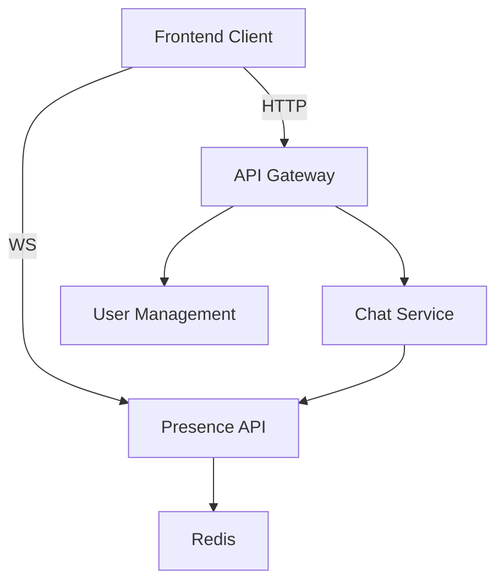

# Presence Service

A real-time user presence tracking microservice for the Transcendence project. This service uses WebSockets and Redis to monitor which users are online and provides an API to query their presence status. It is designed to integrate seamlessly into a distributed, Fastify-based microservices architecture.

---

## 🧩 Purpose

The `presence-service` maintains a live list of online users. Other services (e.g., `chat-service`, `user-management`) can query this service to check if a specific user or list of users is online.

---

## 🚀 Features

- 🔌 WebSocket server for tracking connections
- 🧠 JWT-based user authentication via query param
- ⚡ Real-time presence tracking
- 📦 Redis-backed presence store for horizontal scalability
- 🧾 REST API to query presence status
- 🔐 Designed to work behind an API Gateway

---

## 📚 Architecture Overview



- WebSocket connection on login: `wss://presence-service/ws?token=<JWT>`
- On connect: user is added to `online_users` Redis Set
- On disconnect: user is removed
- Other services call: `GET /online-status?ids=1,2,3`

---

## 🛠️ Tech Stack

- **Runtime**: Node.js + TypeScript
- **Framework**: Fastify + @fastify/websocket
- **Presence Store**: Redis
- **Auth**: JWT (using `@fastify/jwt`)
- **Communication**: REST (HTTP) + WebSocket
- **Containerized**: Docker-ready

---

## 📦 Installation

```bash
git clone https://github.com/ft-transcendence-2025/presence-service.git
cd presence-service
npm install
```

Create a `.env` file:

```env
PORT=3003
HOST=0.0.0.0
JWT_SECRET=your-jwt-secret
REDIS_HOST=redis
REDIS_PORT=6379
```

---

## 🧪 Running the Service

### Development

```bash
npm run dev
```

### Production

```bash
npm run build
npm start
```

---

## 📡 API Endpoints

### WebSocket: `/ws`

**Connect:**

```ws
ws://localhost:3003/ws?token=<JWT>
```

On connection:
- User ID is extracted from JWT
- User is marked online in Redis

On disconnect:
- User is removed from online set

---

### REST: `GET /online-status`

Check which users are online.

**Request:**

```http
GET /online-status?ids=1,2,3
```

**Response:**

```json
[
  { "id": 1, "online": true },
  { "id": 2, "online": false },
  { "id": 3, "online": true }
]
```

---

## 🧱 Redis Keys Used

| Key              | Type     | Purpose                  |
|------------------|----------|--------------------------|
| `online_users`   | Set      | User IDs currently online |

---

## 🧩 Integration Guidelines

Other microservices can:

- Use REST calls to `presence-service` to check user status
- Optionally subscribe to a Redis Pub/Sub channel for status updates (advanced)

---

## 🐳 Docker

You can add this service to your existing `docker-compose.yml`:

```yaml
presence-service:
  build: ./presence-service
  ports:
    - "3003:3003"
  environment:
    - JWT_SECRET=your-secret
    - REDIS_HOST=redis
    - REDIS_PORT=6379
  depends_on:
    - redis
  networks:
    - internal
```

---

## 🔐 Security

- Uses **JWT tokens** for identifying users
- Only allows authenticated WebSocket connections
- Easy to extend with role-based rules or rate limiting

---

## 📄 License

MIT – FT Transcendence 2025 Team
